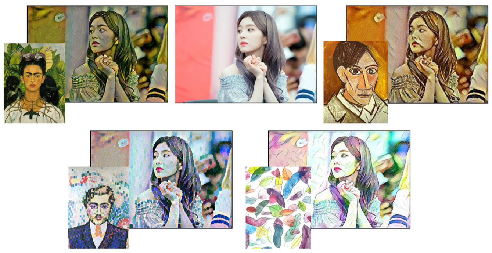
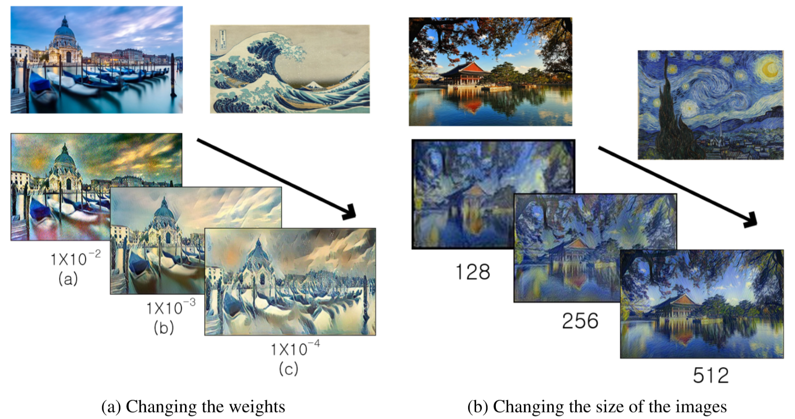
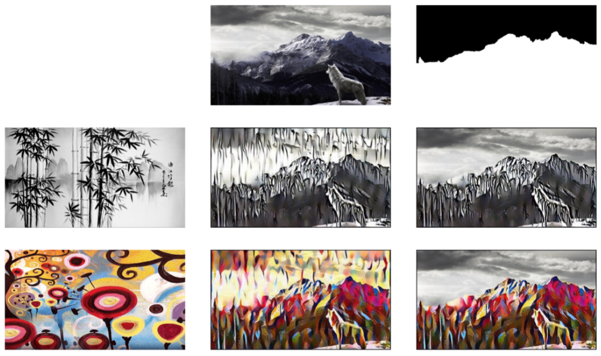
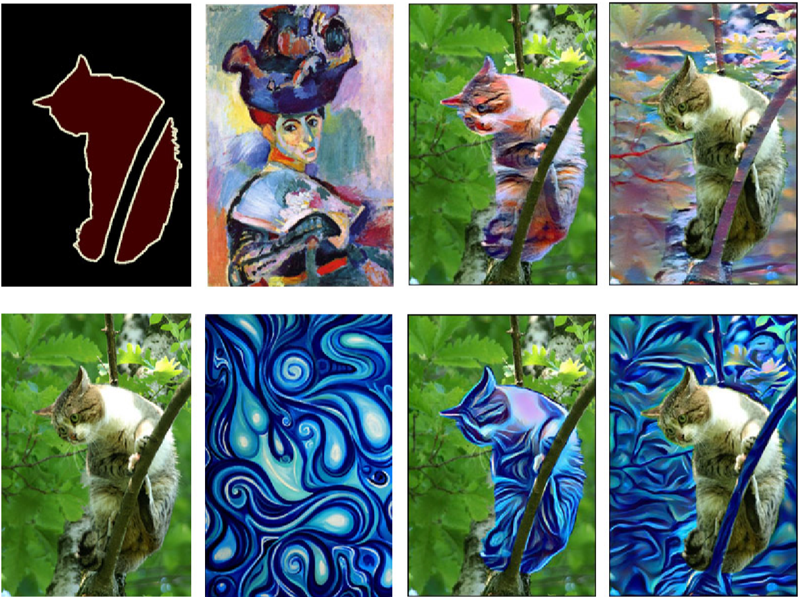
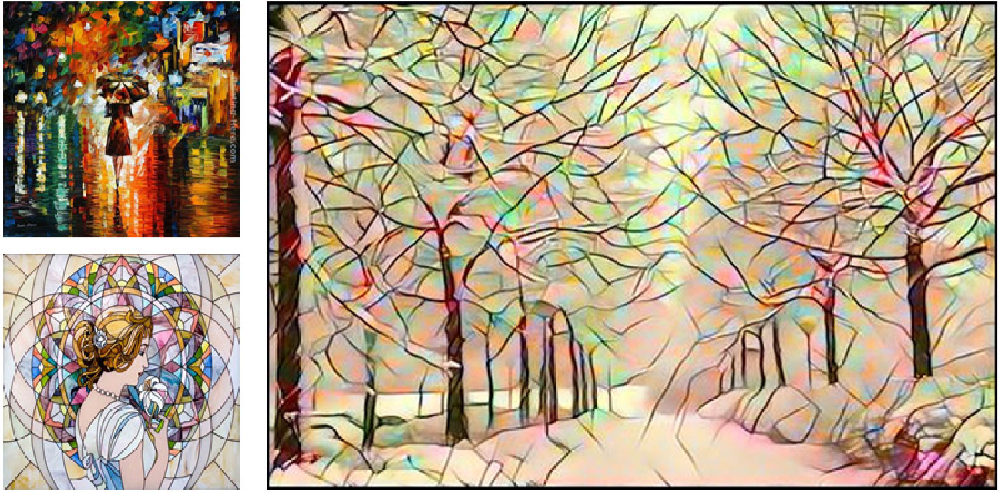

# Style Transfer in Pytorch

## 1. Single Style Transfer
### Result of Single Style Transfer

### Experiments of Style Transfer
Changing the style and content weights & Changing the size of the images

## 2. Masked Style Transfer
### Result of Masked Style Transfer
- Experiments with mask images

- Experiments with PASCAL VOC 2012 Dataset

## 3. Color Style Transfer
### Result of Color Style Transfer

## 4. Color & Style Style Transfer
### Result of Color & Style Style Transfer

## Reference
Pytorch Tutorial Site : http://pytorch.org/tutorials/advanced/neural_style_tutorial.html  
Style Transfer Github(titu1994) : https://github.com/titu1994/Neural-Style-Transfer  
Style Transfer Github(pavelgonchar) : https://github.com/pavelgonchar/color-independent-style-transfer  
